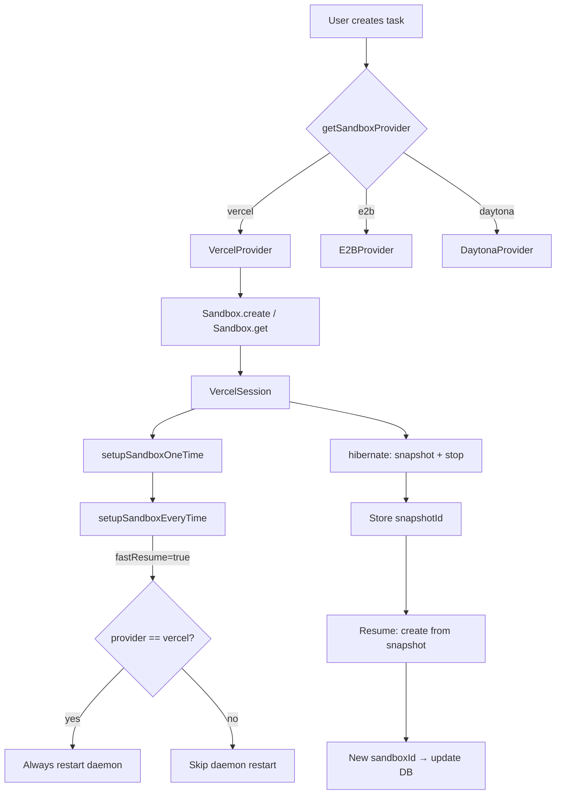

# Add Vercel Sandbox as Additional Provider

## Overview

Add Vercel Sandbox (`@vercel/sandbox` v1.4.1) as a new sandbox provider alongside E2B, Daytona, Docker, and Mock. Vercel becomes an optional provider users can select via settings, gated behind feature flags (following the Daytona pattern).

### Key Differences from E2B

| Aspect          | E2B                                      | Vercel                                                                          |
| --------------- | ---------------------------------------- | ------------------------------------------------------------------------------- |
| Hibernation     | `pause()` — preserves processes + memory | `snapshot()` — filesystem only, processes killed, **new sandbox ID on restore** |
| Terminal/PTY    | Full PTY support                         | **Not supported**                                                               |
| Custom images   | Docker templates via `sandbox-image`     | 3 fixed runtimes: `node24`, `node22`, `python3.13`                              |
| Max session     | 24 hours                                 | 5 hours                                                                         |
| Snapshot expiry | 30-day pause retention                   | 7-day snapshot expiry                                                           |
| Working dir     | `/root` (home), `/root/repo` (repo)      | `/vercel/sandbox` (home + repo)                                                 |
| Env vars        | Set at creation time                     | Per-command only                                                                |
| Command API     | `sandbox.commands.run("cmd string")`     | `sandbox.runCommand({ cmd, args })` — stdout/stderr are async functions         |
| Auth            | `E2B_API_KEY`                            | `VERCEL_SANDBOX_TOKEN` + `VERCEL_SANDBOX_TEAM_ID` + `VERCEL_SANDBOX_PROJECT_ID` |

### Decisions

- **Scope**: Additional provider, not a replacement. E2B remains default.
- **Terminal**: Disabled for Vercel (no PTY API). `isSandboxTerminalSupported()` returns `false`.
- **Hibernation**: Snapshot + cold restart. On resume: restore from snapshot → new sandbox ID → update DB → re-launch daemon.
- **Feature flags**: Follow Daytona pattern with `vercelOptionsForSandboxProvider` and `forceVercelSandbox`.

## Quick commands

```bash
# Type check after changes
pnpm tsc-check

# Run sandbox package tests
pnpm -C packages/sandbox test

# Run shared package tests (feature flags)
pnpm -C packages/shared test

# Run www tests
pnpm -C apps/www test
```

## Acceptance

- [ ] `SandboxProvider` type includes `"vercel"` and all exhaustiveness checks compile
- [ ] `VercelProvider` implements `ISandboxProvider` (getOrCreateSandbox, hibernateById, extendLife, getSandboxOrNull)
- [ ] `VercelSession` implements `ISandboxSession` (runCommand, runBackgroundCommand, readTextFile, writeTextFile, writeFile, hibernate, shutdown)
- [ ] Snapshot-based hibernation works: hibernate → snapshot, resume → restore from snapshot with new sandbox ID written to DB
- [ ] Fast resume always restarts daemon for Vercel provider (processes don't survive snapshot)
- [ ] Terminal returns `false` for Vercel in `isSandboxTerminalSupported()`
- [ ] Broadcast service handles "vercel" case without crashing
- [ ] Feature flags `vercelOptionsForSandboxProvider` and `forceVercelSandbox` exist and gate UI
- [ ] Settings UI shows Vercel option when feature flag enabled
- [ ] Environment variables `VERCEL_SANDBOX_TOKEN`, `VERCEL_SANDBOX_TEAM_ID`, `VERCEL_SANDBOX_PROJECT_ID` configured
- [ ] All `.env.example` files updated
- [ ] Documentation updated (AGENTS.md, docs site)
- [ ] `pnpm tsc-check` passes with no errors

## References

- Vercel Sandbox SDK: https://vercel.com/docs/vercel-sandbox/sdk-reference
- Vercel Sandbox Snapshots: https://vercel.com/docs/vercel-sandbox/concepts/snapshots
- Vercel Sandbox Pricing: https://vercel.com/docs/vercel-sandbox/pricing
- npm: `@vercel/sandbox` v1.4.1
- Reference: `firecrawl/open-lovable` (23K stars) — multi-provider E2B + Vercel
- Reference: `vercel-labs/coding-agent-template` — official Vercel coding agent


